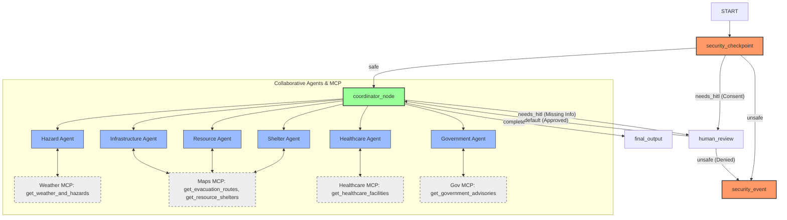
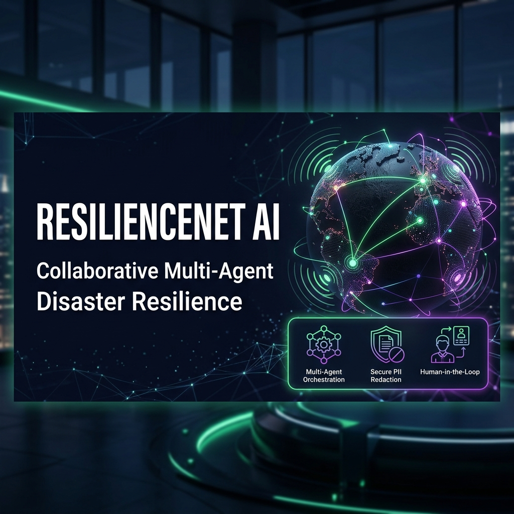
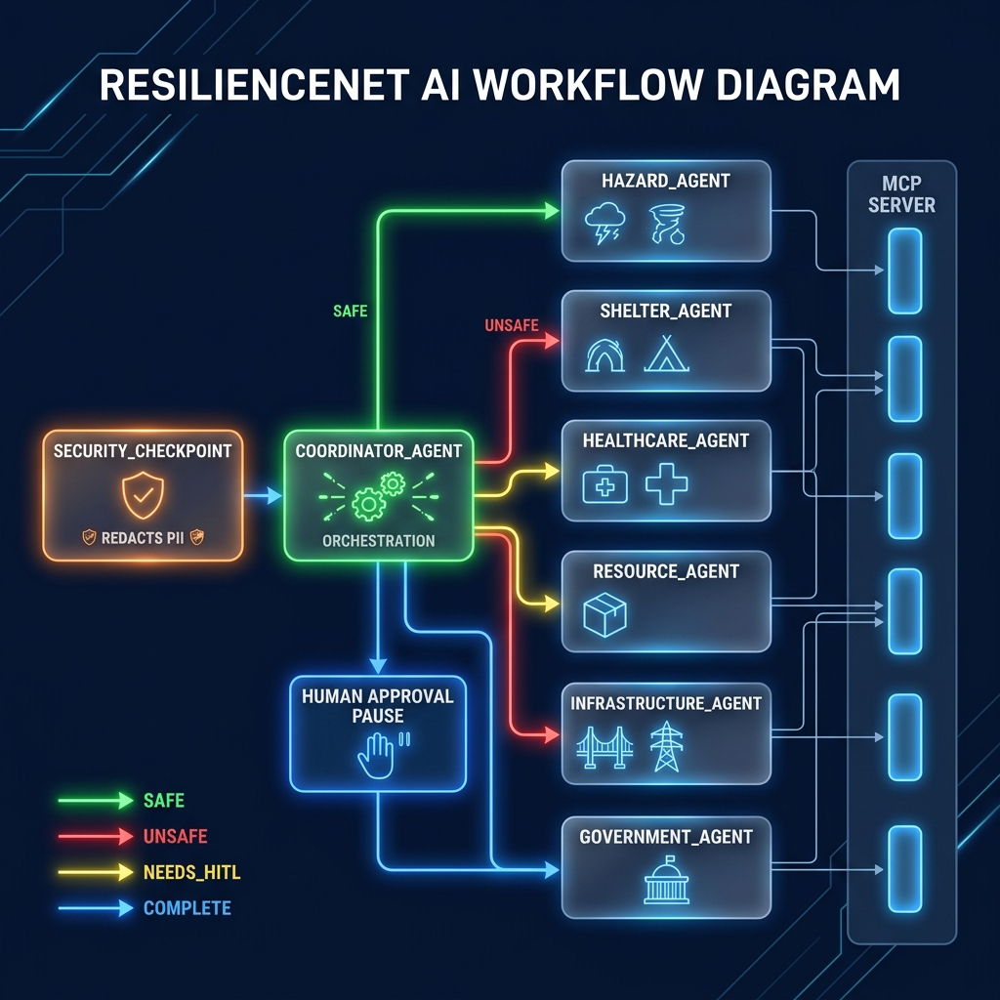

# ResilienceNet AI

ResilienceNet AI is a collaborative multi-agent disaster resilience platform designed to help individuals, families, communities, and emergency response organizations prepare for, respond to, and recover from natural disasters (floods, cyclones, earthquakes, wildfires, and heatwaves).

## Prerequisites

* **Python**: Version 3.11 or higher (Python 3.13 recommended)
* **uv**: Fast Python package installer and resolver (`pip install uv`)
* **Gemini API Key**: Active key from [Google AI Studio](https://aistudio.google.com/apikey)

## Quick Start

```bash
# 1. Clone the repository
git clone <repo-url>
cd resiliencenet-ai

# 2. Configure environment variables
cp .env.example .env
# Open .env and add your GOOGLE_API_KEY

# 3. Install dependencies and set up the virtual environment
make install

# 4. Start the local ADK Playground
make playground
# This will launch the web UI at http://localhost:18081
```

## Solution Architecture

ResilienceNet AI uses a collaborative multi-agent workflow coordinated by a central orchestrator. Security and safety policies (PII scrubbing, prompt injection detection, and user consent) are enforced at the entry checkpoint.



## How to Run

* **Interactive Playground (Recommended)**:
  ```bash
  make playground
  ```
  Opens the local web interface at `http://localhost:18081` to test the multi-agent chats, view node traces, and interact with the Human-in-the-Loop consent and details gates.

* **API Server Mode**:
  ```bash
  make run
  ```
  Starts the local FastAPI server for programmatic access and Agent-to-Agent (A2A) routing.

* **Run Automated Tests**:
  ```bash
  make test
  ```
  Runs the pytest suite located in the `tests/` directory.

## Sample Test Cases

### Test Case 1: Flood Scenario (Triggers Consent + PII Redaction)
* **Input**:
  ```text
  I am in San Francisco, and there is a flood warning in my area. My phone number is 555-019-2831. I need to know where the nearest shelter is.
  ```
* **Expected**:
  1. The `security_checkpoint` detects sensitive keywords (`San Francisco`, `shelter`) and routes to `needs_hitl` since consent has not been granted.
  2. The workflow pauses and prompts the user for consent.
  3. The `security_checkpoint` redacts the phone number `555-019-2831` to `[PHONE_REDACTED]`.
  4. Once the user replies `Yes`, the workflow resumes. The `coordinator_agent` calls the `hazard_agent` and `shelter_agent` to fetch flood data and shelter routes, then synthesizes a guide.
* **Check**:
  * The terminal log shows: `{"event": "PII_REDACTED", "severity": "INFO", "types_redacted": ["phone"]}`.
  * The UI presents a yes/no dialog: `ResilienceNet AI requires your consent to process location or health-related data. Do you grant permission to proceed?`.

### Test Case 2: Wildfire Scenario (Asthma / Medical Constraints)
* **Input**:
  ```text
  I am near Los Angeles, and a wildfire is spreading. The air is very smoky and I have asthma. What should I do and where is the nearest medical center?
  ```
* **Expected**:
  1. The `security_checkpoint` triggers the consent flow (since `asthma` and `medical` are health-related).
  2. Upon consent, the `coordinator_agent` calls the `hazard_agent` (for fire details), `healthcare_agent` (for asthma guidance and hospital directory), and `shelter_agent` (for evacuation paths away from smoke).
  3. The agents return specific guidance on managing asthma during smoke exposure and list nearby medical centers in Los Angeles.
* **Check**:
  * The console logs `API CALL: Invoking healthcare_agent` and `API CALL: Invoking shelter_agent`.
  * The final output provides breathing advice for asthma and details on nearest clinics.

### Test Case 3: Rate-Limit Recovery (429 Backoff)
* **Input**:
  * Send multiple rapid queries in succession (e.g. Cyclone Scenario then Heatwave Scenario).
* **Expected**:
  1. Under the hood, the rapid agent calls hit the Gemini free-tier rate limit (5 RPM).
  2. The `run_node_with_retry` function catches the `429 RESOURCE_EXHAUSTED` error.
  3. The workflow pauses, logs a retry warning, waits for the backoff period, and automatically resumes without failing the user session.
* **Check**:
  * The terminal logs: `Gemini API rate limit hit (429) for node 'coordinator_agent'. Retrying in 2.0s...`.

## Troubleshooting

1. **Error**: `400 INVALID_ARGUMENT - API key not valid`
   * **Fix**: Open your `.env` file and make sure `GOOGLE_API_KEY` is set to a valid, active key from Google AI Studio. Restart the server after saving.
2. **Error**: `Uvicorn address already in use` (port 18081)
   * **Fix**: A stale playground process is running. Kill it using the following PowerShell command:
     ```powershell
     Get-Process -Id (Get-NetTCPConnection -LocalPort 18081 -ErrorAction SilentlyContinue).OwningProcess | Stop-Process -Force
     ```
3. **Error**: `mcp.server.lowlevel.server ... unhandled errors in a TaskGroup`
   * **Fix**: This happens if the MCP server fails to launch. Make sure `uv` is installed and available in your system PATH, as the agents execute the MCP server using `uv run`.

## Push to GitHub

1. Create a new repo at https://github.com/new
   - Name: resiliencenet-ai
   - Visibility: Public or Private
   - Do NOT initialize with README (you already have one)

2. In your terminal, navigate into your project folder:
   ```bash
   cd resiliencenet-ai
   git init
   git add .
   git commit -m "Initial commit: resiliencenet-ai ADK agent"
   git branch -M main
   git remote add origin https://github.com/<your-username>/resiliencenet-ai.git
   git push -u origin main
   ```

3. Verify `.gitignore` includes:
   ```text
   .env          ← your API key — must NEVER be pushed
   .venv/
   __pycache__/
   *.pyc
   .adk/
   ```

⚠ **NEVER push `.env` to GitHub. Your API key will be exposed publicly.**

## Assets

### Cover Page Banner


### Workflow Architecture Diagram


## Demo Script

The spoken narration script for presenting this project is available at [DEMO_SCRIPT.txt](DEMO_SCRIPT.txt).

