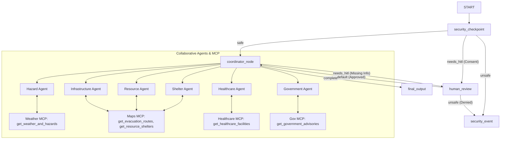

# Submission Write-Up: ResilienceNet AI

## Problem Statement
During natural disasters (floods, cyclones, wildfires, earthquakes, and heatwaves), critical information is often fragmented across multiple disparate sources: weather services, emergency shelter databases, healthcare facility directories, road and utility infrastructure reports, and official government advisories. 

Individuals, families, and emergency response volunteers struggle to gather and synthesize this information quickly, which can lead to delayed evacuations, unsafe routing, or lack of access to medical care and essential resources. 

ResilienceNet AI solves this by coordinating specialized AI agents that collaborate to deliver timely, reliable, and highly personalized disaster resilience guidance from trusted sources.

---

## Solution Architecture

ResilienceNet AI is built as a collaborative multi-agent platform using the Google Agent Development Kit (ADK) 2.0. A central coordinator manages sub-agents that query domain-specific Model Context Protocol (MCP) servers. A security checkpoint at the entry of the workflow handles input safety, PII redaction, and user consent.

---

## Concepts Used

1. **ADK Workflow**: Coordinates the multi-agent nodes and handles transitions and routing.
   * *File Reference*: [app/agent.py](file:///c:/Users/B%20SAI%20KARTHIK%20GOUD/OneDrive/Documents/AIAgents/adk_worksspace/resiliencenet-ai/app/agent.py#L328-L341)
2. **LlmAgent**: Used to define the `coordinator_agent` and all 6 specialized sub-agents.
   * *File Reference*: [app/agent.py](file:///c:/Users/B%20SAI%20KARTHIK%20GOUD/OneDrive/Documents/AIAgents/adk_worksspace/resiliencenet-ai/app/agent.py#L57-L157)
3. **AgentTool**: Wraps sub-agents as tools so the Coordinator can call them dynamically.
   * *File Reference*: [app/agent.py](file:///c:/Users/B%20SAI%20KARTHIK%20GOUD/OneDrive/Documents/AIAgents/adk_worksspace/resiliencenet-ai/app/agent.py#L143-L149)
4. **Model Context Protocol (MCP) Server**: A FastMCP server exposing 5 tools that simulate real-time weather, maps, healthcare, resources, and government advisories.
   * *File Reference*: [app/mcp_server.py](file:///c:/Users/B%20SAI%20KARTHIK%20GOUD/OneDrive/Documents/AIAgents/adk_worksspace/resiliencenet-ai/app/mcp_server.py)
5. **Security Checkpoint (Workflow Node)**: Sanitizes input, redacts PII, and enforces location/medical data consent before the coordinator executes.
   * *File Reference*: [app/agent.py](file:///c:/Users/B%20SAI%20KARTHIK%20GOUD/OneDrive/Documents/AIAgents/adk_worksspace/resiliencenet-ai/app/agent.py#L173-L243)
6. **Agents CLI**: Used to configure, scaffold, and test the project locally.
   * *File Reference*: [agents-cli-manifest.yaml](file:///c:/Users/B%20SAI%20KARTHIK%20GOUD/OneDrive/Documents/AIAgents/adk_worksspace/resiliencenet-ai/agents-cli-manifest.yaml)

---

## Security Design

To ensure user safety and data privacy during emergencies, the following security controls are implemented in the `security_checkpoint` node:
* **PII Redaction**: Any email addresses, phone numbers, or national identifiers (SSNs) are scrubbed and replaced with redaction tokens (e.g. `[PHONE_REDACTED]`) before reaching the LLM to prevent data leaks.
* **Prompt Injection Defense**: Input is scanned against a list of keywords (e.g., `ignore previous instructions`, `override`) and immediately routed to `security_event` to block attacks.
* **Consent Verification**: Any query mentioning location or medical/health needs triggers a Human-in-the-Loop (HITL) prompt asking for user consent before proceeding.
* **Structured Audit Logging**: Key security events (redactions, injection attempts, and consent decisions) are logged as JSON objects without exposing raw user data.

---

## MCP Server Design

The platform integrates a custom Model Context Protocol (MCP) server that exposes five domain-specific tools:
1. `get_weather_and_hazards`: Fetches live weather conditions, hazard levels, and active disaster warnings.
2. `get_evacuation_routes`: Calculates safe routing and distances between locations during emergencies.
3. `get_healthcare_facilities`: Locates nearby hospitals, clinics, and emergency medical services.
4. `get_resource_shelters`: Identifies active emergency shelters, capacity, and resource distribution points.
5. `get_government_advisories`: Retrieves official government safety alerts and emergency helplines.

Sub-agents access these tools under **least-privilege filters** (e.g. the `hazard_agent` can only access `get_weather_and_hazards`).

---

## Human-in-the-Loop (HITL) Flow

During natural disasters, AI must not act autonomously on sensitive data or make assumptions about critical constraints. We implement two HITL gates:
1. **Consent Gate**: Triggered when the user query mentions location or health. The workflow suspends and requests explicit permission using `RequestInput`. If denied, the session is safely terminated.
2. **Details Gate**: Triggered when the Coordinator Agent determines it lacks crucial context to give safe advice (e.g. if the user has pets, needs wheelchair access, or has elderly family members). The workflow suspends and prompts the user for details before completing the synthesis.

---

## Demo Walkthrough

### 1. Flood Scenario (Consent & Redaction)
* **Input**: `"I am in San Francisco, and there is a flood warning. Call me at 555-019-2831. Where is the nearest shelter?"`
* **Flow**: The checkpoint redacts the phone number to `[PHONE_REDACTED]`, flags the sensitive location query, and triggers the HITL Consent Gate. The user approves, the coordinator calls the `shelter_agent`, and the shelter options are displayed.

### 2. Wildfire Scenario (Asthma / Medical Constraints)
* **Input**: `"I am near Los Angeles and a wildfire is spreading. The air is smoky and I have asthma. What should I do?"`
* **Flow**: The checkpoint requests consent for health data. Once granted, the coordinator consults the `healthcare_agent` and `shelter_agent` to provide medical breathing advice and locate clean-air shelters.

### 3. Rate-Limit Recovery (429 Backoff)
* **Input**: Rapid succession of emergency queries.
* **Flow**: Under heavy load, the free-tier 5 RPM limit is exceeded. The system catches the 429 error, waits, and retries automatically using exponential backoff without crashing the user session.

---

## Impact & Value Statement

ResilienceNet AI empowers:
* **Citizens & Families**: By providing immediate, clear, and privacy-safe emergency guidance.
* **NGOs & Relief Workers**: By identifying resource gaps and shelter capacities in real-time.
* **First Responders**: By reducing the load on emergency hotlines through automated, high-fidelity information synthesis.
* **Vulnerable Groups**: By explicitly factoring in mobility, medical, and pet constraints during evacuation planning.
